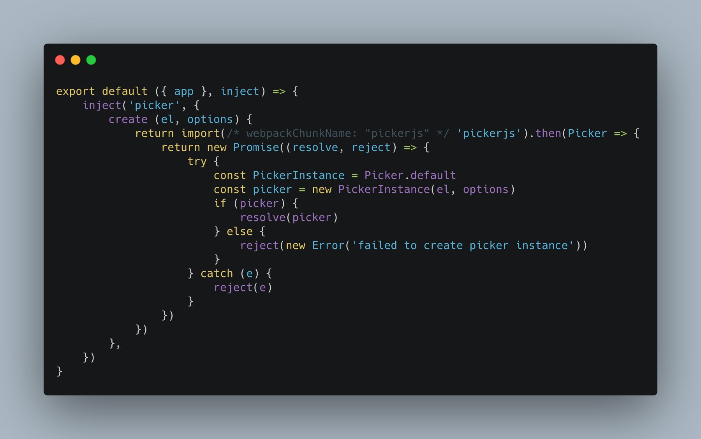
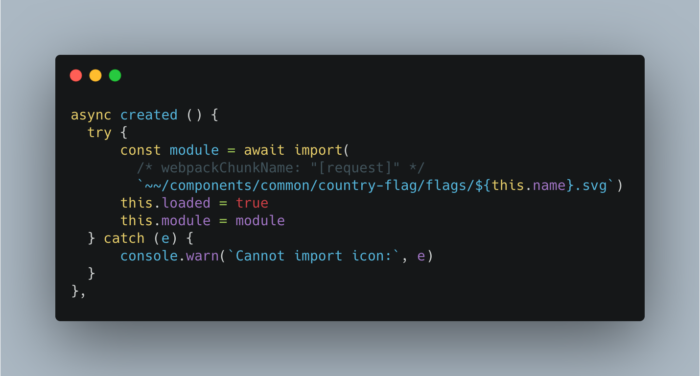
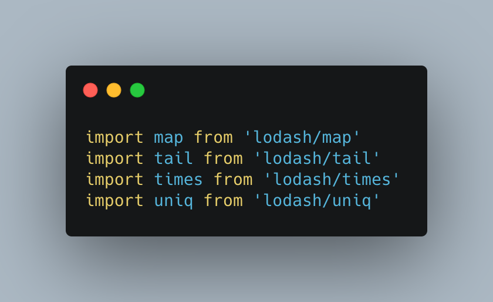

Hi!
In this post I’ll cover some tips to give your web application performance boost. Let's get started!

**Some examples are from Vue project but the following tips can be used regardless of the framework.*

## 1. Code splitting

Web applications are getting bigger and have more and more javascript code, which is the most expensive resource we send to users.
The solution to this problem is, among others code splitting, which allows to send the user only the part of the code that is required in a given view instead of sending a large monolithic package. Other packages will be downloaded by the user only on demand. Thanks to this, we significantly increase control over the priority of loading resources and reduce the amount of unnecessary code downloaded by the user.

**Code-splitting can be done at the view, route or component level.*

## 2. Dynamic import of third-party libraries

A similar situation, as in the first point is with third-party libraries. They are often very heavy and significantly burden application performance. In addition, some libraries are only used on single views. We can use our knowledge from the previous point, and do the same with external libraries: load them only when needed.

## 3. Remove unnecessary third-party libraries and replace them with less burdensome solutions

Analyze the libraries you use. Check their cost (you can use the great website [bundlephobia.com](https://bundlephobia.com/)) and think about whether you can replace them with a less burdensome solution. An example would be the removing a vue-country-flag library (Unpacked Size: 1.09 MB) and replacing it with svg icons which are downloaded on demand

## 4. Import only necessary parts of libraries

We often use large and heavy libraries such as lodash or moment.js in our applications. Importing an entire library is tempting because it is clear and imports only fit into one line of code.

`import _ from ‘lodash’`

However, this solution has its serious disadvantage. Importing the entire library will lead to the largest bundle size and will negatively impact application performance. Fortunately, solving this problem is pretty easy. We can import only needed functions from the library

Unfortunately this solution has some disadvantages too. For each method we have to import specific function from the library. So we have another option, we can use *babel-plugin-lodash* together with *lodash-webpack-plugin* for cherry-picking only the used functions. In this case we can import the full Lodash library only once at the beginning of the file, and the plugins will take care of the rest during the build. Unfortunately, as in previous cases, this option also has a drawback, namely the potential increase of a build time. So If you use a very small amount of functions - you should only import them one-by-one. But if you use dozens of functions, then use Babel & WebPack plugins. Thanks to this solution, we will only download those library functions that we actually use.

## 5. Remove unnecessary css

Unused CSS slows down a browser's construction of the render tree and makes maintenance much more difficult than it has to. Unused CSS slows down a browser's construction of the render tree.
To remove unused CSS you can use [PurgeCSS](https://purgecss.com/) library. This tool is very effective in cleaning out unused css styles and very easily configure.

**The render tree is very similar to the DOM tree, except that it also includes the styles for each node.*

## 6. Compress components with Gzip/Brotli

Gzip/Brotli compresses your webpages and style sheets before sending them over to the browser. When a user enters to your website a call is made to your server to deliver the requested files. The bigger these files are the longer it's going to take for them to get to your browser.
For example Nuxt has great module ([nuxt-compress](https://www.npmjs.com/package/nuxt-compress)) that runs Gzip and Brotli compression during the build process. If you are working with other library you can use compression-webpack-plugin.

## 7. Cache assets with Service Worker

A service worker is a specific type of JavaScript worker, which is a script that runs in the background of the user's browser.
Great benefit of service worker is ability to cache all of its necessary resources. Thanks to that you can substantially improve load times for your returning visitors.

## 8. Preload critical bundles

As a developers we should know which resources are the most important for our page. With that in mind we can request the critical resources ahead of time and speed up the loading process.
The simplest way to implement preload is to add a `link` tag to the `head` of the document:

`<link rel="preload" as="script" href="critical.js">`

## 9. Reduce the size of photos and icons

According to HTTP Archive, as of November 2018, images make up on average 21% of a total webpage’s weight.
You should use this knowledge optimize each image on your website. That means, it should have an optimal size so your site’s loading doesn’t get affected by it.

How to do it:
* Reduce file size before uploading
* Use an image optimizer
* Host your images on a CDN
* Add a lazy load plugin

Images optimizations definitely will improve your site’s performance, SEO and generate a better user experience.

## 10. Preconnect to required origins

Using the keyword preconnect gives a signal to the bowser to establish early connections to important third-party origins. Establishing connections often involves significant time in slow networks. The way to implement preload is to add a `link` tag to the `head` of the document:

`<link rel="preconnect" href="https://www.example.com">`

Thank you and hope you learned something valuable from this.

## References
* [The Cost Of JavaScript In 2018](https://medium.com/@addyosmani/the-cost-of-javascript-in-2018-7d8950fbb5d4)
* [PageSpeed: Enable compression](https://gtmetrix.com/enable-gzip-compression.html)
* [Preload critical assets to improve loading speed](https://web.dev/preload-critical-assets/)
* [Measuring the Real-world Performance Impact of Service Workers](https://developers.google.com/web/showcase/2016/service-worker-perf)
* [4 Ways to Optimize Your Images for the Web and Improve Your Site’s Performance](https://artisanthemes.io/optimize-images-for-web-improve-performance/)
* [Preconnect to required origins](https://web.dev/uses-rel-preconnect/)
* [The Correct Way to Import Lodash Libraries - A Benchmark](https://www.blazemeter.com/blog/the-correct-way-to-import-lodash-libraries-a-benchmark)

